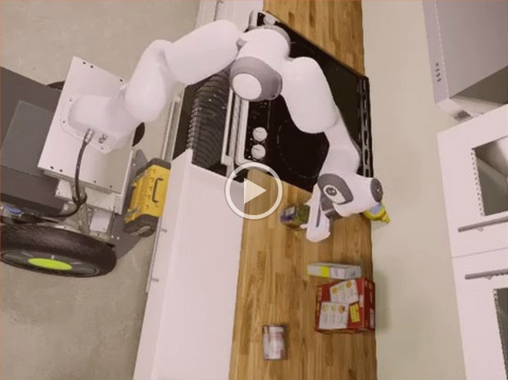

STRIPStream planning for SRL's Franka Panda Robot in a kitchen environment.

[Project Proposal](https://drive.google.com/open?id=1GZHmCP3a8Ep1Ib5smqvwoA5bST6i2PTVMxszGUbQKQg)

# Installation

* `sudo apt install cmake g++ make python`
* `pip install numpy scipy pybullet`
* `git lfs clone --recurse-submodules https://gitlab-master.nvidia.com/cgarrett/srl-stripstream.git`
* `cd srl-stripstream`
* `./pddlstream/FastDownward/build.py release64`

# PyBullet Examples

* `git pull --recurse-submodules`
* `./run_pybullet.py`

# IsaacSim Examples

Install the SRL Robotics System by following these [instructions](https://gitlab-master.nvidia.com/SRL/srl_system/tree/master). 
Launch IsaacSim:
* `roslaunch isaac_bridge sim_franka.launch cooked_sim:=true config:=panda_full lula:=false`

In a separate terminal, run the STRIPStream planner:
* `git pull --recurse-submodules`
* `./run_isaac.py`

# Resources

This repository uses STRIPStream to perform hybrid robotic planning. 
STRIPStream leverages FastDownward, a classical planner, as a discrete search subroutine.
Common robotics primitives are implemented using PyBullet.

## STRIPStream

* [STRIPStream Paper](https://arxiv.org/abs/1802.08705)
* [STRIPStream Github Repository](https://github.com/caelan/pddlstream)
* [STRIPStream Tutorial](https://web.mit.edu/caelan/www/presentations/6.881_TAMP.pdf)

## PDDL and FastDownward

* [Planning Domain Description Language (PDDL)](http://users.cecs.anu.edu.au/~patrik/pddlman/writing.html)
* [PDDL Derived Predicates](https://www.cs.cmu.edu/afs/cs/project/jair/pub/volume28/coles07a-html/node18.html)
* [FastDownward Homepage](http://www.fast-downward.org/)

## PyBullet

* [PyBullet Package](https://pypi.org/project/pybullet/)
* [PyBullet Quickstart Guide](https://docs.google.com/document/d/10sXEhzFRSnvFcl3XxNGhnD4N2SedqwdAvK3dsihxVUA/edit)

# Resources

Please email Caelan Garrett at <cgarrett@nvidia.com> for installation and usage help.
